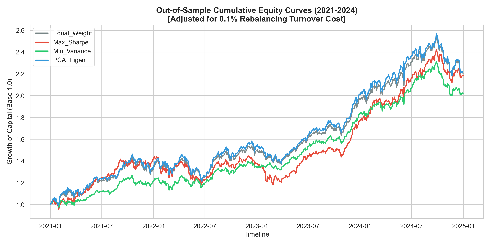
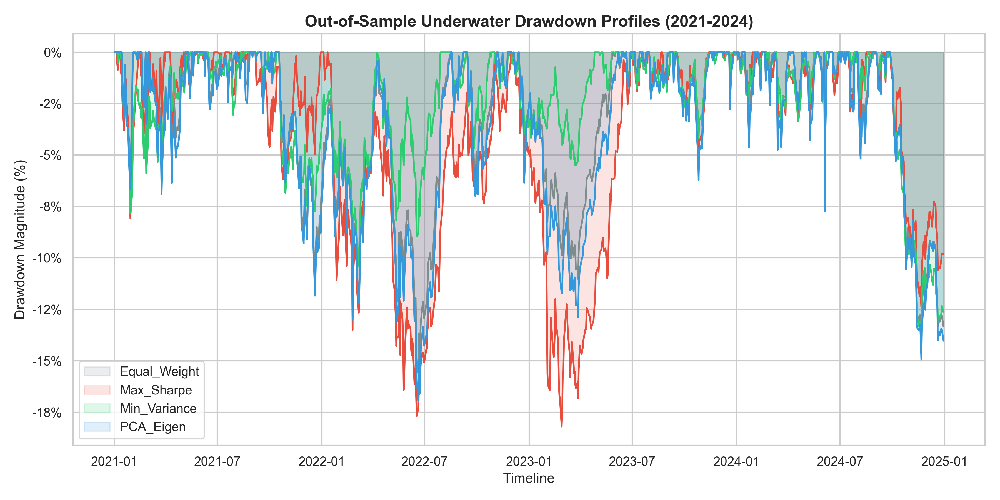
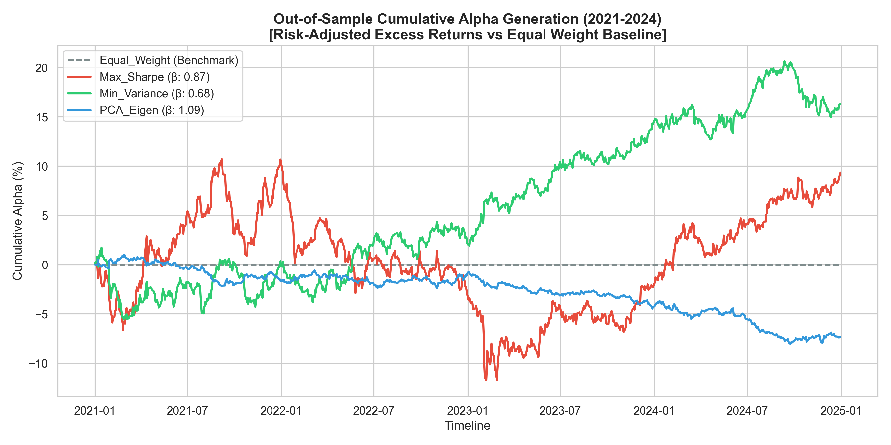

# Multi-Model Quantitative Portfolio Optimization & Risk Engine

An institutional-grade out-of-sample backtesting framework designed to evaluate four competing asset allocation methodologies across an equity universe of 53 high-volume equities. The engine applies advanced data-leakage protections, numerical optimization stabilizers, and rigorous factor-risk attribution.

## 🛠️ Project Architecture & Pipeline

The pipeline is engineered across localized, modular scripts to enforce point-in-time calculation boundaries:

1. **Phase 1 & 2 (`src/features.py`)**: Automatic ingestion of daily asset returns. Computation of technical features (RSI, Momentum, CAPM Beta) and execution of **Strategy A Data Guardrail** (handling pre-IPO missing blocks via dynamic row filtering and forward-filling price propagation).
2. **Phase 3 (`src/features.py`)**: Chronological Walk-Forward Isolation. Splitting data into Train (2010–2018), Validation (2019–2020), and Test (2021–2024) pools. To avoid look-ahead leakage, Z-score feature scaling parameters are fitted exclusively on the training block.
3. **Phase 4 (`src/models.py`)**: The Parallel Allocation Engine. Houses our four distinct investment strategies under strict institutional constraints: Long-Only ($w_i \ge 0$), Full Investment ($\sum w_i = 1$), and a strict Maximum Asset Concentration Ceiling ($w_i \le 0.10$).
4. **Phase 5 & 6 (`src/backtest.py`)**: The Monthly Rebalancing Simulation Engine. Steps day-by-day through the out-of-sample test horizon, applies a **0.1% transaction fee penalty** based on calculated portfolio weight turnover, and logs risk-adjusted performance vectors.

---

## 📊 The Allocation Strategies

* **Equal Weight ($1/N$ Baseline)**: Distributes capital uniformly across all active assets. Serves as our zero-estimation-error benchmark.
* **Markowitz Max Sharpe MVO**: Optimizes for the maximum reward-to-variability ratio. Utilizes **James-Stein shrinkage** on expected return vectors and **Ledoit-Wolf shrinkage** on the underlying covariance matrix to suppress parameters overfitting to historical noise.
* **Global Minimum Variance (GMV)**: Completely blind to return forecasts. Optimizes strictly to find the global minimum-variance basin on the efficient frontier using a shrunken covariance landscape.
* **PCA Eigen-Portfolio (12 Factor)**: Decomposes the covariance structure into orthogonal principal components. Stacks the top 12 components to filter localized idiosyncratic noise, weighting assets based on their composite sensitivity to dominant systemic drivers.

---

## 📈 Out-of-Sample Performance Scorecard (2021–2024)

Evaluated under strict chronological walk-forward constraints and adjusted for a **0.1% transaction fee penalty per rebalance turnover**:

| Metric | Equal_Weight (Benchmark) | Max_Sharpe (MVO) | Min_Variance (GMV) | PCA_Eigen (12-Factor) |
| :--- | :--- | :--- | :--- | :--- |
| **Total Return** | 120.59% | 118.47% | 101.86% | **120.82%** |
| **Annualized Return** | 22.41% | 22.11% | 19.66% | **22.44%** |
| **Annualized Volatility** | 15.06% | 15.50% | **11.92%** | 16.58% |
| **Sharpe Ratio** | 1.4884 | 1.4260 | **1.6496** | 1.3534 |
| **Max Drawdown** | -15.60% | -18.20% | **-13.54%** | -16.96% |
| **Systematic Beta ($\beta$)** | 1.00 | 0.87 | **0.68** | 1.09 |
| **Annualized Alpha ($\alpha$)** | 0.00% (Base) | 2.39% | **4.17%** | -1.87% |

---

## 👁️ Visual Risk & Return Analytics

### 1. Cumulative Growth of Capital
Tracks the compounding wealth of 1.0 unit of currency deployed on January 1, 2021. 


### 2. Risk Manager's Underwater Drawdown Profile
Maps out the peak-to-trough valley corrections, highlighting strategy resilience during market structural breaks.


### 3. Cumulative CAPM Alpha Generation
Flattens out the broad market's rising tide to showcase the pure, risk-adjusted value added or subtracted by each model's asset allocations.


---

## 🔑 Crucial Quantitative Takeaways

1. **GMV Dominance**: The strategy that completely ignored return forecasting (**Global Minimum Variance**) was the undisputed risk-adjusted winner of the out-of-sample trial, securing a **Sharpe Ratio of 1.6496** and an **Annualized Alpha of 4.17%**. By eliminating return estimation errors, it navigated market corrections smoothly.
2. **The Overfitting Trap of Max Sharpe**: Despite advanced Ledoit-Wolf and James-Stein shrinkage modifications, the aggressive concentration tendencies of MVO caused it to hit the 10% maximum constraint boundary on old historical winners. This concentration backfired during the early 2023 regime break, generating the deepest drawdown (**-18.20%**) and underperforming the basic Equal Weight baseline on a risk-adjusted basis.
3. **PCA and Hidden Beta Loading**: The 12-component PCA model successfully matched the raw absolute returns of the index but carried a high systematic market sensitivity (**Beta of 1.09**). Through the lens of CAPM, this added risk resulted in a negative risk-adjusted alpha (**-1.87%**), showing that it operated as an unhedged leverage play on broad market factors rather than a source of unique stock alpha.

## 🚀 How to Reproduce the Pipeline

Ensure you have your environment configured, then execute the localized scripts in precise chronological sequence:

```bash
# 1. Install dependencies
pip install -r requirements.txt

# 2. Run feature extraction, data scaling, and walk-forward chronological splitting
python src/features.py

# 3. Test underlying model allocation algorithms & window stability matrices
python src/models.py

# 4. Launch the monthly walk-forward out-of-sample backtest & plot generator
python src/backtest.py

---

## 4. Final Verification Check

With your codebase frozen, your repository file layout should look exactly like this:

```text
portfolio/
│
├── data/                       (Ignored by git, contains your CSV files)
│   ├── log_returns.csv
│   ├── feature_rsi.csv
│   ├── feature_momentum.csv
│   └── splits/
│
├── plots/                      (Tracked by git, rendered in README)
│   ├── cumulative_equity_curves.png
│   ├── underwater_drawdowns.png
│   └── cumulative_alpha_curves.png
│
├── src/                        (Tracked by git)
│   ├── features.py
│   └── models.py
│   └── backtest.py
│
├── .gitignore
├── requirements.txt
└── README.md
